Extra Stars Plate Solving Algorithm
===================================

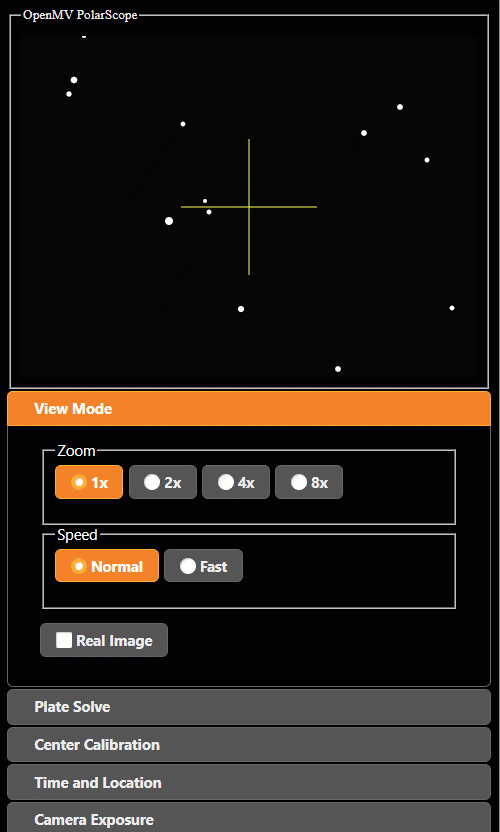

I wanted another feature: identify other stars that are not Polaris. This would help people if they get "lost". If people can identify what they are pointed at, they can use additional smartphone apps to help navigate towards Polaris.

The database needs to be compact (I explain later). The stars in the database are only the ones within 45° of Polaris, with a sufficient brightness. I expect the user to at least know roughly where North is and also capable of turning the latitude knob correctly before even turning on this camera.

The match algorithm is similar to the one used to identify Polaris. The database contains a set of vectors for each star, each vector representing the vector between the target star and a neighboring star. But unlike the other algorithm, instead of establishing a reference angle using the first neighboring star, this new algorithm simply checks all 360 possible angles. To visualize, the vectors are simply being spun until matches are made:

Possible pattern matches are scored by number of matched stars and the total error. The result with the lowest average error is shown to the user at the end as a sorted list. (lowest average error is the total summed error divided by the number of matches, so a higher number of matches causes a lower average error)

For a very dense image, getting a false-positive pattern match is very likely. Later I added the ability to penalize the score if a bright star is somewhere in the pattern's area but isn't expected. This lowered the probability of a false-positive result.

The entire routine will iterate through all 500 stars in the database so it's quite slow. So I made it only operate on one star that the user selects.

Generating the Database
=======================

The goal of generating the database can be visualized as generating what the camera would see. For the stars very close to the NCP, the projection method is the same as the algorithm that identifies Polaris. The azimuthal equidistant projection.

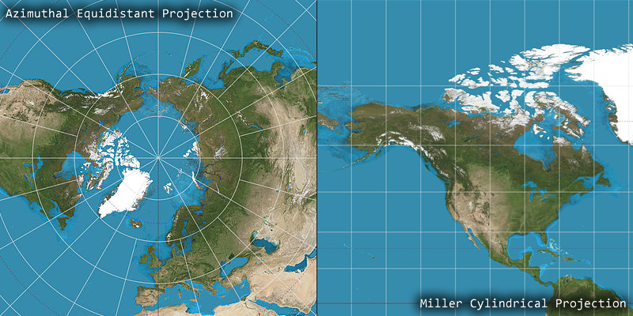

For the stars with a lower declination, the distortion will cause too much error. To understand using an example, pretend 1° arc-distance is scaled as 100 camera pixels. To draw the equator using azimuthal equidistant projection, this would mean the radius of the circle will be 90° away, equal to 9000 camera pixels. Calculating the circumference of that circle, the diameter is 18000 pixels, so the circumference is 56548.7 pixels. What should this be? It should be 36000 pixels, the error is 57%!

Doing this again at about 80° declination, `90° - 80° = 10°` so the radius is 1000 pixels, diameter is 2000 pixels, circumference is 6283 pixels. The expected circumference should be equal to... `cos(80°) = 0.17365`, and then `36000 * 0.17365 = 6251` pixels! The difference being only about 32 pixels is awesome, that's only 0.5% of error. The star Polaris is usually about 28 pixels in diameter on the camera sensor.

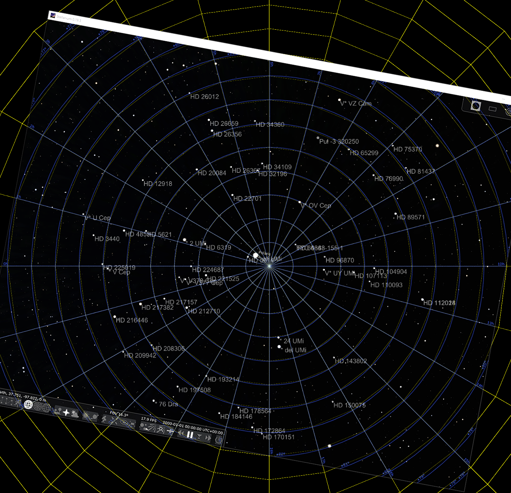

The above shows what the azimuthal equidistant projection looks like at the North Pole, it's a perfect match when overlaid with Stellarium. Here's what the azimuthal equidistant projection looks like for a star that's at 61° declination:

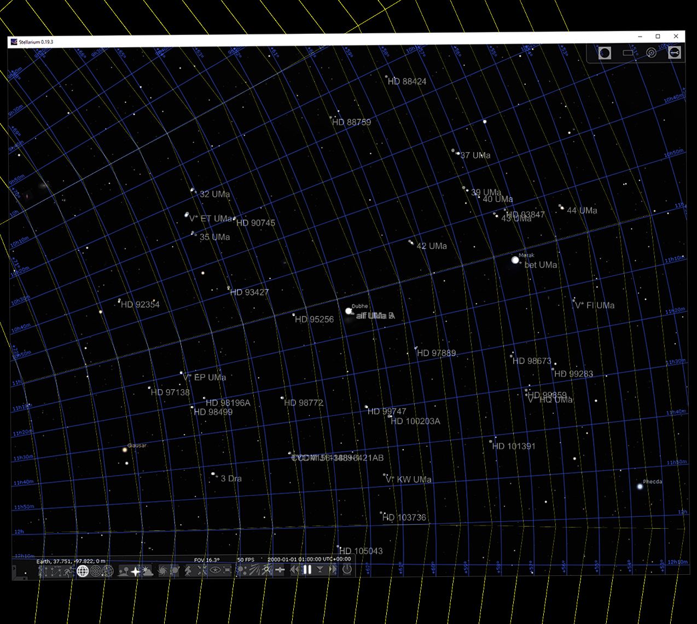

Notice that it's not a perfect match. It's close, but the error becomes high, the stars are shifted, and the lines stop matching up. In a real-world test, the average errors can be pretty low, 20 pixels or less. It's usable but we can do better.

The database is kind of split in two. The stars above 80° declination uses azimuthal equidistant projection. The rest of them uses a different kind of projection. I tried a few and I will list them all below. The best one used two fundamental formulas, first to calculate the arc-distance between two stars, and the second formula calculates the angle between two arcs when given a triangle. From the Wikipedia pages [https://en.wikipedia.org/wiki/Great-circle_distance](https://en.wikipedia.org/wiki/Great-circle_distance) and [https://en.wikipedia.org/wiki/Solution_of_triangles](https://en.wikipedia.org/wiki/Solution_of_triangles)

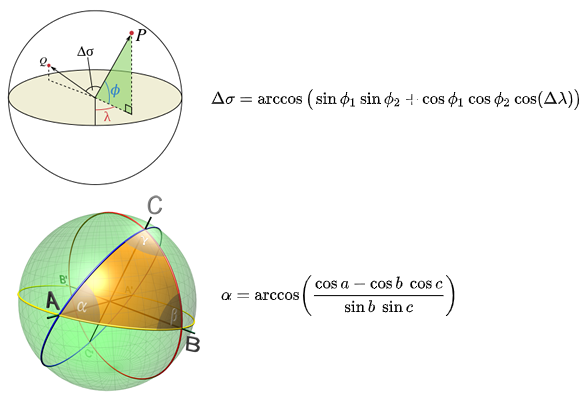

The results were spectacular compared to the other projection methods I've tried. Here's an image of the projection as generated by my Python script overlayed with a screenshot from Stellarium:

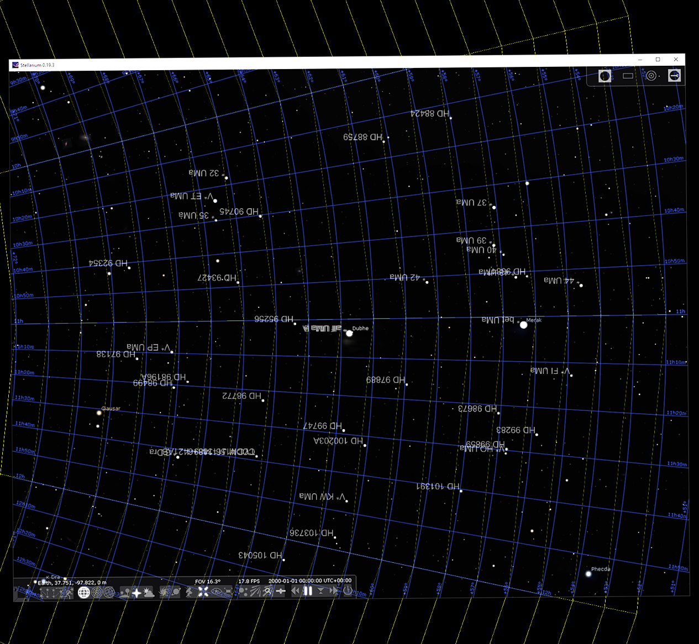

When I used the database generated from this projection, **real-world** tests can result in average errors of about 4 pixels!

I understand that using Stellarium (in stereographic projection mode) as a validation tool may not be the best idea. However, the above overlay shows a near perfect match, and the real-world tests show average errors that can be considered noise. So I will continue to use these overlaid screenshots for visualization purposes.

Other Projection Methods
========================

Another weird experiment I tried is using kind of a warped cylinder, let me explain: At the equator, if a 1° arc is 100 pixels, then 1° declination means 100 pixels in the Y axis, and 1° of right-ascension is also 100 pixels in the X axis. But if we move above the equator, to a declination of 60°, then 1° of declination is still 100 pixels in the Y axis, but 1° of right-ascension should now be 50 pixels in the X axis. This is because `cos(60°) = 0.5`

The resulting preview looks like:

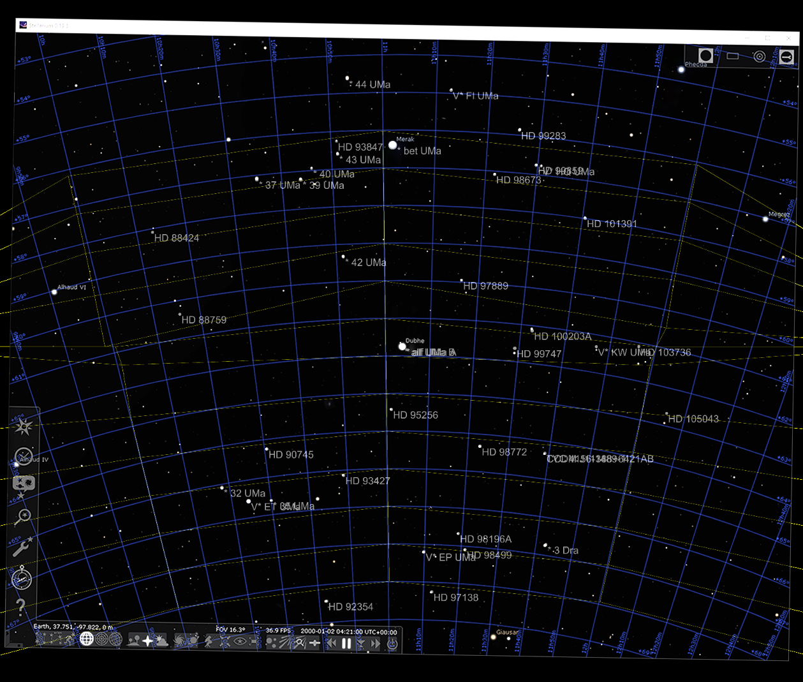

There's definitely some math weirdness going on. The line calculations are failing and I don't know why. Most of the stars are dead on target but some of them are very off. Real world tests still gets average error under 10 pixels sometimes but this method is not one I would rely on.

Doing research on the topic of projection methods, gnomonic projection is supposedly the one I'm supposed to use, as it's supposedly how an image of the stars is projected through a telescope.

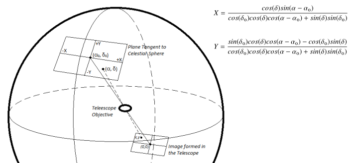

But using the equation unmodified, but as intended, the results is very distorted and nothing matched

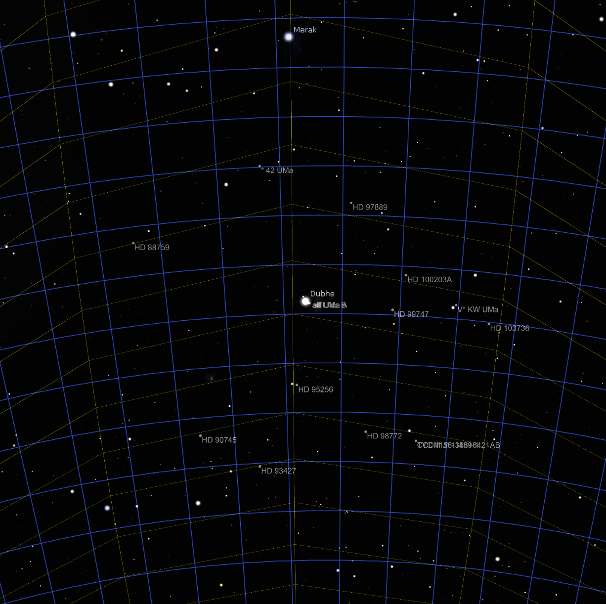

I toyed around with the equations, such that the declination is scaled correctly and equidistant. The result looks better but still distorted in the X axis:

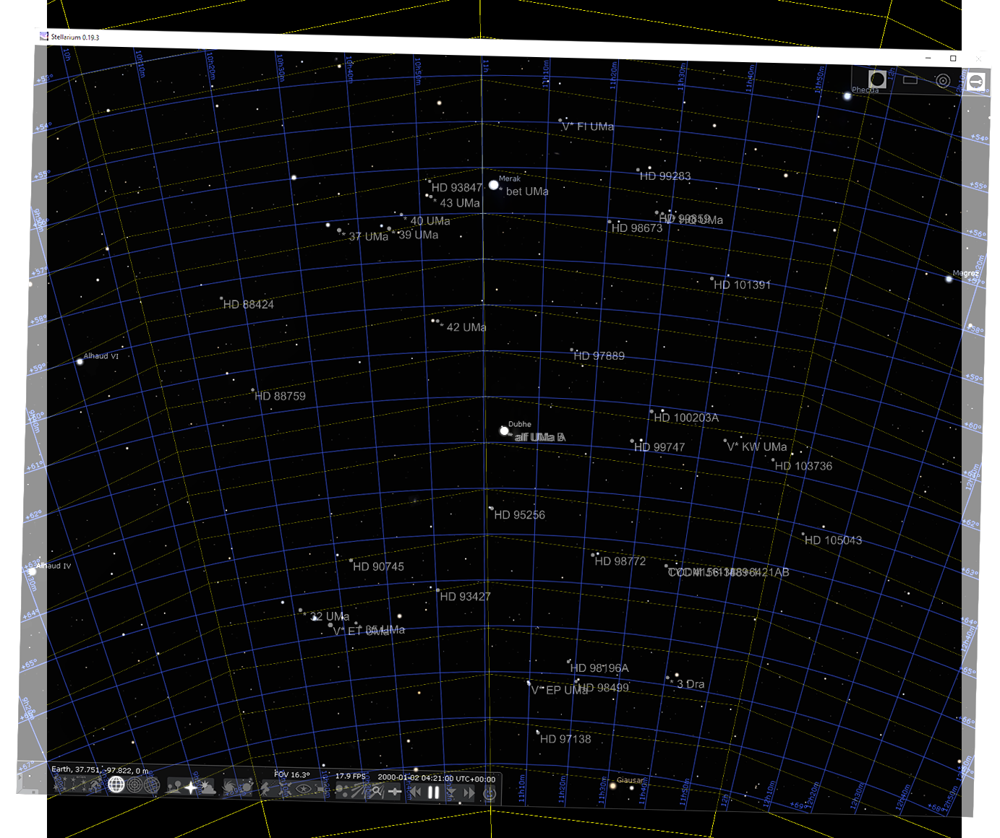

It looks like it still needs a stretch about both X and Y. At this point I don't even know if my equation modifications are valid so I stopped trying gnomonic projection.

Other Technical Challenges
==========================

I tried using MicroPython to load the database and immediately ran out of memory due to the overwhelming amount of data required. So I decided to put this feature into the JavaScript instead, it would be more responsive, and a progress bar would not require additional HTTP requests.

This also meant the database had to be in ASCII, as JavaScript cannot load any binary files. I fit a database of about 2700 stars, 500 identifiable, into a single string in JavaScript. This used about 300kb more data and added more than a second of page loading time. If I exceed 5 seconds, a mobile browser could timeout.

You may have noticed some of my screenshots don't have perfectly straight lines where they should be. I have tried to use arbitrary precision number libraries to see if the calculations end up different, they did not. I also tried to implement trigonometry functions with Taylor series, all that did was slow down the script enough that I couldn't finish running it overnight.

How Other People Do This
========================

The best plate solving tool right now is probably [nova.astrometry.net](https://nova.astrometry.net/), which is so good that most open-source plate solvers are nothing more than an image uploader to their web server. It is capable of plate solving an entire image, multiple stars on it, without knowing the image scale or distortion.

As far as I understand, it's using signatures that are made of triangles. Basically, triangles all have three distinct angles, by using angles and not directly using distances, the signature matching is quick and also ignores image scale. It also uses kd-trees for quick searching.

It's a bit more complicated than just that, it's doing something called **geometric hashing**. I'm guessing it's because hashes are unique and quicker to do matching with.

For more info, look for Dustin Lang's PhD thesis title **Astrometry.net: Automatic recognition and calibration of astronomical images**. [Here's a copy from University of Toronto's library](https://tspace.library.utoronto.ca/bitstream/1807/19281/3/Lang_Dustin_A_200911_PhD_thesis.pdf), Dustin Lang also hosts his thesis on [his own GitHub](https://github.com/dstndstn/thesis), but it's written in TeX.

I have looked around for an open source plate solver in Java, so that it might work on Android, but found nothing useful.

I've found somebody else who has coded a astrophotograph stacker in C++ and he talks about how he builds constellations out of these triangles, and kd-trees, in order to align multiple images for stacking: [https://benedikt-bitterli.me/astro/](https://benedikt-bitterli.me/astro/)

[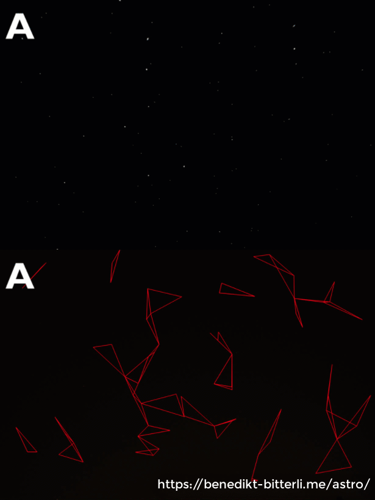](https://benedikt-bitterli.me/astro/)

